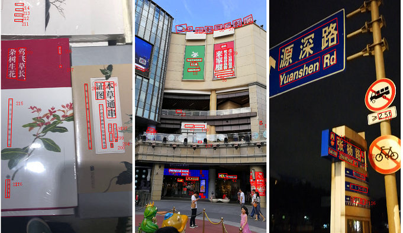

### Introduction ##

In this paper, we introduce a large-scale vedio text dataset(LSVTD). In recent years, research in video scene text 
still remains unpopular in contrast to its promising application prospect. The existing
video scene text datasets are limited on the scale of video items and scenarios, which may
restrain research of video scene text spotting. Therefore, we collect
and annotate LSVTD, which contains
100 scene videos acquired from 22 typical real-life scenarios

LSVTD mainly characterized is described in detail as follows:

1. Much larger scale. LSVTD has 100 videos, consists of 66700 frames and 569300 instances.

2. More diversified scenarios. LSVTD covers a wide
range of 13 indoor (eg. bookstore, shopping mall) and 9 outdoor
(eg. highway, city road) scenarios. The variety of scenarios challenges text spotting
algorithms to achieve robust performance. 

3. Multilingual text instances.
LSVTD contains text with more than three kinds of languages
(English, Spanish and Chinese etc.), which are further divided
into 2 major categories: Latin and Non-Latin. We additionally
label this attribute for the convenience of evaluation for different
algorithms. In additon, each text region is labeled with quality score.

### Tutorial ##

<!-- ### Files ##
* [Paper](?????????????????????????)
* [Dataset](????????????????????????????????) -->

### Evaluation Server ##

### Contact ##

If you have any questions about the dataset or code, please contact Jing Lu (lujing6@hikvision.com.cn).

### Change Log ##

### Terms of Use ##
