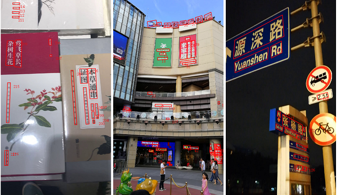

### Introduction ##

Here, we release a large-scale video text dataset named LSVTD. 
In recent years, research in video scene text still remains unpopular in contrast to its promising application prospect. 
The existing video scene text datasets are limited on the scale of video items and scenarios, which may restrain research of video scene text spotting. 
Therefore, we collect and annotate LSVTD, which contains 95 scene videos acquired from 22 typical real-life scenarios. 

Note that, in the origin paper, we have decaleard that LSVTD contains 100 videos. 
Unfortunately, due to some privacy policy, we have to remove 1 video text scenario (including five videos), i.e., only 21 video text scenarios including 95 videos are released. 


LSVTD mainly characterized is described in detail as follows:

1. Much larger scale. LSVTD has 95 videos, consists of more than 60k frames and 500k instances.

2. More diversified scenarios. LSVTD covers a wide range of 13 indoor (eg. bookstore, shopping mall) and 8 outdoor (eg. highway, city road) scenarios. The variety of scenarios challenges text spotting algorithms to achieve robust performance. 

3. Multilingual text instances. LSVTD contains text with more than two kinds of languages
(English and Chinese etc.), which are further divided into 2 major categories: Latin and Non-Latin. We additionally label this attribute for the convenience of evaluation for different algorithms. In addition, each text region is labeled with quality score.

<center></center>
### Dataset released

- Videos: 95 videos are provided in total, in which 74 videos for training and 21 videos for testing. 

- Annotations: only the training annotations (.xml) are provided. 

  If you need evaluate your algorithm on the testing set, please send us the predicted results (same as the annotation format)  by email. 

  We will give you the evaluation results as soon as possible.  In future, we will consider add the on-line evaluation server or provide a evaluation tool. 

- Dataset request: If you need this dataset, please email us [See Contact]. We will share a download link with you. **Tips**: Please tell us your *name* and *institute* in your email.


### Contact ##

If you have any questions about the dataset, please contact Jing Lu or Zhanzhan Cheng .(lujing6kh[at]163.com or 11821104[at]zju.edu.cn).


### Terms of Use ##

- The public annotations belong to Zhejiang University and are licensed under the [Creative Commons Attribution-NonCommercial-ShareAlike 4.0 International License](http://creativecommons.org/licenses/by-nc-sa/4.0/).

- The images belong to Zhejiang University and are licensed under the [Creative Commons Attribution-NonCommercial-ShareAlike 4.0 International License](http://creativecommons.org/licenses/by-nc-sa/4.0/).

  

### Change Log ##

- 2019-10-21 (GMT+8): dataset released
- 2019-10-21 (GMT+8): website create


<br><br/>

<!-- BibTex here (Make sure that this is the last code block) -->
```
@inproceedings{cheng2019you,
  title={You Only Recognize Once: Towards Fast Video Text Spotting},
  author={Cheng, Zhanzhan and Lu, Jing and Niu, Yi and Pu, Shiliang and Wu, Fei and Zhou, Shuigeng},
  booktitle={Proceedings of the 27th ACM International Conference on Multimedia},
  pages={855--863},
  year={2019},
  organization={ACM}
}
```


