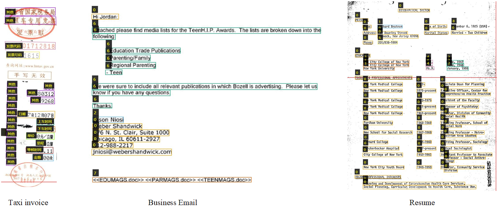

# VRD Datasets
### Introduction ##
We here group visually rich documents (VRDs) into four categories along the dimensions of layout and text type. Layout refers to the relative position distribution of texts or text blocks, which contains two modes: the fixed mode and the variable mode. The former connotes documents that follow a uniform layout format, such as passport and the national value-added tax invoice, while the latter means that documents may appear in different layouts. Referring to previous work[<sup>1</sup>](#refer-anchor), we define text type into two modalities: the structured and the semi-structured. In detail, the structured type means that document information is organized in a predetermined schema, i.e., the key-value schema of the document is predefined and often tabular in style, which delimits entities to be extracted directly. For example, receipts in SROIE usually have quite a uniform tabular-like layout and information structure like ‘Company’, ‘Total’, ‘Date’ etc. The semi-structured type connotes that document content is usually ungrammatical, but each portion of content is not necessarily organized in a predetermined format. For example, a resume may include some predefined fields such as job experience and education information. Within the job experience fields, the document may include free text to describe the person’s job experience. For this example, the user may desire to search on free text only within the job experience field. Table 1 summarizes the categories of visually rich documents from previous research literatures. 

**Table 1. Categories of visually rich document scenarios.**

<center></center>

Most existing works tend to verify their methods on private datasets due to their privacy policies, which leads to the difficulties for fair comparisons between different approaches. Though existing datasets like SROIE have been released, they mainly falls into the Category III, i.e., documents with variable layout and structured text type. The remain three kinds of application scenarios (Category I, II and IV) have not been studied well because of the limited real-life datasets. To boost the research of VRD understanding, we here extend the categories of VRD, especially on Category I, II and IV. Table 2 shows the detailed statistics of these benchmarks from four category perspectives. 

- *Category I* refers to document images with uniform layout and structured text type, which is very common appearing in everyday life. Contrastively, its research datasets are very limited due to various privacy policies. Here, we find only two available benchmarks, i.e., train ticket and passport dataset released[<sup>2</sup>](#refer-anchor), which are generated with a synthetic data engine and provides only entity-level annotations. To remedy this issue, **we release a new real-life dataset containing 5000 taxi invoice images. Except for providing the text position and character string information for OCR tasks (text detection and recognition), entity-level labels including 9 entities (Invoice code, Invoice number, Date, Get-on time, Get-off time, Price, Distance, Wait time, Total), in which many images are low-quality such as blur.**
- *Category II* refers to those documents with fixed layout and semi-structured text type like business email or national housing contract. NER datasets like CLUENER2020[<sup>3</sup>](#refer-anchor) are only collected for NLP tasks, and they provide only semantic content while ignoring the important layout information. We think that the joint study of OCR and IE is very essential. Unfortunately, we have not found available datasets which contains both OCR and IE annotations. **We also ascribe the issue to various privacy policies. We here collect a new business email dataset, which has 1146 email images with 35346 text instance and 15 entities (To, From, CC, Subject, BCC, Text, Attachment, Date, To-key, From-key, CC-key, Subject-key, BCC-key, Attachment-key, Date-key).**
- *Category III* means documents are with variable layout and structured text type like purchase receipt dataset SROIE[<sup>4</sup>](#refer-anchor). These datasets are usually composed of small documents (e.g., purchase receipts, business card, and taxi invoice etc.), and entities are organized in a predetermined schema. We note that most previous literatures focus on this category. We here list five available datasets. SROIE is a scanned receipt dataset widely evaluated in many methods, which is fully annotated and provides text position, character string and key-value labels. Buisiness card[<sup>2</sup>](#refer-anchor) is a synthesized dataset released , and has only key-value pair annotations without OCR annotations. FUNSD[<sup>5</sup>](#refer-anchor) is a dataset aiming at extracting and structuring the textual content from noisy scanned forms. It has only 200 forms with 4 kinds of entities, i.e., question, answer, header and other.  CORD[<sup>6</sup>](#refer-anchor) is a consolidated receipt dataset, which contains images and box/text annotations for OCR, and multi-level semantic labels for parsing. EPHOIE[<sup>7</sup>](#refer-anchor) is a Chinese examination paper head dataset, in which each image is cropped from the full examination paper. This dataset contains handwritten information, and is also fully annotated. WildReceipt[<sup>8</sup>](#refer-anchor) is a large receipt dataset collected from document images of unseen templates in the wild. It contains 25 key information categories, a total of about 69000 text boxes.
- *Category IV* means documents have variable layout and semi-structured text type like resume. Different with those datasets in Category III, Kleister-NDA[<sup>9</sup>](#refer-anchor) aims to understand long documents (i.e., Non-disclosure Aggreements document), but it provides only 540 documents with 4 general entity classes. **To enrich this category, we release a large-scale resume dataset, which has 1527 images with 10 kinds of entities(Name, Time, School, Degree, Specialty, Phone number, E-mail, Birth, Title, Security code) for long document. Since resumes are different each other, this dataset is a classic document dataset with variable layout and semi-structured text.**

**Table 2. Statistics of popular VRD benchmarks. pos, text and entity mean the word position, character string and entity-level annotations, respectively. Term ‘Syn’ and ‘Real’ separately mean the dataset is generated by a synthetic data engine and manual collection.**

<center></center>


#### Challenges in different kinds of documents

It will be the most straightforward task to extract entities from documents in Category I, which attributes to its complete fixed layout and structured text type. For this kind of documents, challenges are mainly from the text reading part, such as the distorted interference. The standard object detection methods like Faster-RCNN also can be further developed to handle this task. In Category II, the layout is fixed, but the text is semi-structured. Thus, in addition to modelling layout information, we also should pay attention to mining textual information. Then some NLP techniques like the pre-trained language model can be exploited. As to the text reading part, long text recognition is also challenging. Documents in Category III face the problem of complex layout. Thus the layout modelling methods like graph neural networks are widely developed for coping with this issue. The documents in Category IV are in the face of both complex layout and NLP problems, which becomes the most challenging task. 

### Dataset Information ##
<center></center>

-Documents: 5000, 1645, 1527 document images for Taxi invoice, Business email and Resume datasets, respectively. 
-Annotations: Position, text and entity level labels are provided. Each image is fully annotated.

**An annotation example on Taxi invoice:**

```
{"chuzuche_test_617007145401_10_8.jpg": 
    {"content_ann": 
        {
            "texts": ["湖南省国家税务局", "出租车专用发票", "143001712818", "12551615", "单位", "051", "电话", "85580312", "车号", "A-T9268", "证号", "日期", "2017年12月07日", "上车", "18:27", "下车", "18:45", "单价", "2.00元/公里", "里程", "5.8公里", "等候", "00:07.11", "金额", "19.00元", "卡号"], 
            "cares": [1, 1, 1, 1, 1, 1, 1, 1, 1, 1, 1, 1, 1, 1, 1, 1, 1, 1, 1, 1, 1, 1, 1, 1, 1, 1], 
            "bboxes": [[39, 47, 39, 12, 253, 12, 253, 45], [38, 83, 38, 49, 255, 51, 256, 83], [39, 193, 38, 157, 253, 161, 253, 191], [44, 230, 44, 202, 185, 202, 185, 232], [47, 356, 47, 334, 88, 334, 88, 355], [204, 363, 205, 341, 247, 343, 247, 365], [46, 386, 46, 364, 89, 364, 89, 386], [132, 393, 131, 367, 248, 369, 249, 393], [47, 416, 47, 395, 88, 395, 87, 416], [147, 425, 146, 399, 249, 399, 250, 425], [45, 447, 45, 426, 86, 426, 86, 447], [45, 478, 46, 456, 86, 457, 85, 479], [91, 484, 91, 459, 251, 456, 250, 487], [45, 509, 46, 487, 85, 488, 84, 508], [173, 516, 173, 492, 246, 492, 247, 516], [44, 538, 44, 517, 82, 517, 82, 538], [172, 547, 172, 523, 251, 522, 252, 546], [44, 569, 44, 548, 84, 547, 84, 569], [129, 577, 129, 551, 248, 550, 248, 578], [42, 600, 42, 577, 84, 578, 84, 600], [169, 609, 168, 583, 246, 582, 246, 608], [42, 630, 43, 607, 83, 608, 82, 630], [128, 637, 127, 613, 243, 611, 243, 638], [42, 660, 42, 638, 83, 639, 83, 661], [156, 670, 156, 643, 245, 643, 245, 670], [43, 689, 43, 669, 82, 669, 81, 690]], 
            "labels": [["其他"], ["其他"], ["发票代码"], ["发票号码"], ["其他"], ["其他"], ["其他"], ["其他"], ["其他"], ["其他"], ["其他"], ["其他"], ["日期"], ["其他"], ["上车时间"], ["其他"], ["下车时间"], ["其他"], ["单价"], ["其他"], ["里程"], ["其他"], ["等候时间"], ["其他"], ["金额"], ["其他"]]
        }, 
        "height": 791, 
        "width": 286,
    },  
}
```
-Dataset access: *coming soon*

### Contact ##
If you have any questions about the dataset, please contact Zhanzhan Cheng (11821104[at]zju.edu.cn).

### Terms of Use ##
- The public annotations and trained models belong to the CSCG Group and are licensed under the [Creative Commons Attribution-NonCommercial-ShareAlike 4.0 International License](http://creativecommons.org/licenses/by-nc-sa/4.0/).
- The images belong to Zhejiang University and are licensed under the [Creative Commons Attribution-NonCommercial-ShareAlike 4.0 International License](http://creativecommons.org/licenses/by-nc-sa/4.0/).

<div id="refer-anchor"></div>

### References

[1] Apparatus and method for searching and retrieving structured, semi-structured and unstructured content.

[2] EATEN: Entity-Aware Attention for Single Shot Visual Text Extraction.

[3] CLUENER2020: fine-grained named entity recognition dataset and benchmark for chinese.

[4] ICDAR2019 Competition on Scanned Receipt OCR and Information Extraction.

[5] FUNSD: A Dataset for Form Understanding in Noisy Scanned Documents.

[6] CORD: A Consolidated Receipt Dataset for Post-OCR Parsing.

[7] Towards Robust Visual Information Extraction in Real World: New Dataset and Novel Solution.

[8] Spatial Dual-Modality Graph Reasoning for Key Information Extraction.

[9] Kleister: A novel task for Information Extraction involving Long Documents with Complex Layout.

### Change Log ##
- 2021-10-08 (GMT+8): website create

